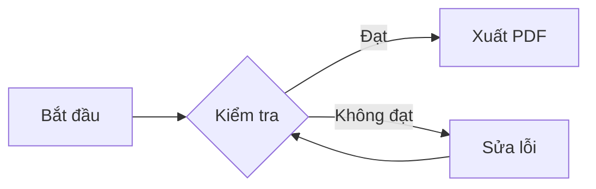
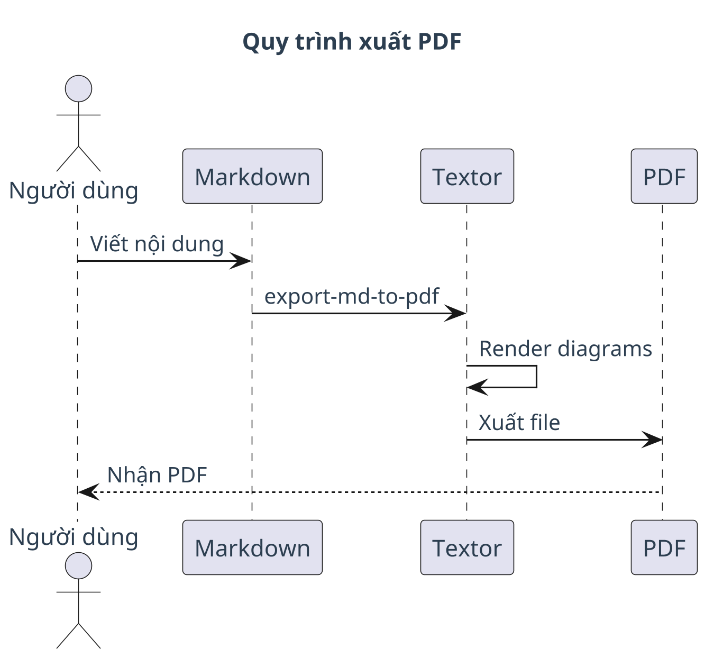

## Tóm tắt


Tài liệu mẫu minh họa cách sử dụng Textor để tạo PDF từ Markdown với diagram.


## Tổng quan


Textor hỗ trợ 3 loại diagram: Mermaid (nhanh), PlantUML (UML), TikZ (toán học).


## Ví dụ Mermaid


### Flowchart





### Mindmap


```mermaid
mindmap
  root((Textor))
    Mermaid
      Flowchart
      Sequence
      Mindmap
    PlantUML
      Class
      Activity
      Salt
    TikZ
      Math
      Vector
```


## Ví dụ PlantUML


### Sequence Diagram





## Kết luận


Textor giúp chuyển đổi Markdown thành PDF chuyên nghiệp với diagram chất lượng cao[^1].


[^1]: Textor Doc Converter v3.1.0. Script: /home/fong/Projects/textor-doc-converter/run-807f321188c6.sh.
